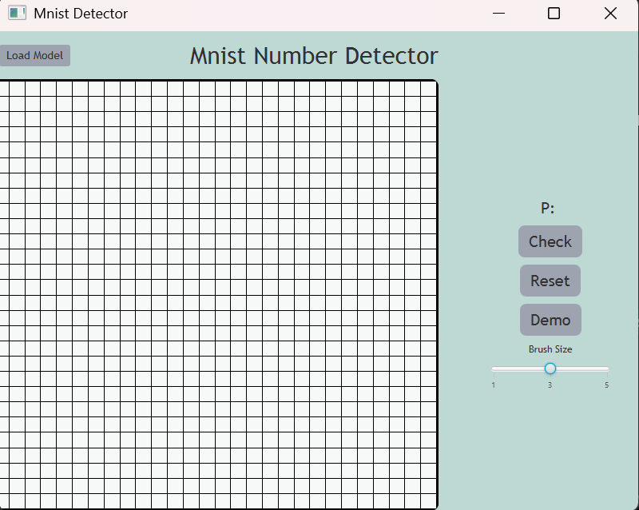

# MnistVectorized

**Mnist Vectorized** is a small project where I revisit creating a fully connected neural network.
The last time I attempted this I had not taken linear algebra, and thus implemented the network completely elementwise.
No matrix multiplications, etc. As you can imagine, there were some gremlins in my code I could never get rid of,
and I plateaued at 80% accuracy. Quite bad. However now with linear algebra in my toolbox, I can properly complete
the beginners challenge of implementing a neural network from scratch. After 50 epochs, I can currently get around 97.7%
accuracy with 2 hidden layers of 128 neurons each. Not bad!

## Getting Started
To use this project, please clone the repository
```shell
git clone https://github.com/Ademfcan/MnistVectorized.git
cd MnistVectorized
```
If you just want to try it out, you can run the jar file in the [releases section](https://github.com/Ademfcan/MnistVectorized/releases/)

Once there, there are two main things you can do. Train a new model, or use the GUI with a existing model.

## Creating a new model
Creating a new model is simple:
1. Define your layers
2. Define a data loader
3. Pick your learning rate (can be dynamic) 
4. Pick how to stop training (after n epochs, or when accuracy plateaus, etc)
5. Train your model

For example here is how to train a model from the emnist (extended-mnist) dataset, with custom input preprocessing

```java
    import Activation.ActivationFunction;
    import Data.MnistLoader;
    import Layers.InputLayer;
    import Layers.Layer;
    import Layers.OutputLayer;
    import Learning.ConstantLearningRate;
    import Learning.LearningRateProvider;
    import Network.NNetwork;
    import Training.BatchedTrainer;
    import Training.EndCondition;
    import Training.EpochEndCondition;
    import org.nd4j.linalg.api.ndarray.INDArray;
    import org.nd4j.linalg.ops.transforms.Transforms;
    
    import java.io.File;
    import java.io.IOException;
    import java.util.function.Function;    

    public class example {
    /**
     * Example method for training on the emnist-digits dataset,
     * with custom preprocessing to threshold the float inputs of 0-1 by 0.5
     * [0-1] -> 0 if <= 0.5 or 1 if > 0.5 
     */
    public static void main(String[] args) throws IOException {
        // constant learning rate of 0.015
        LearningRateProvider constant = new ConstantLearningRate(0.015);

        // take in flattened 28x28 input,
        // run through hidden layers, 
        // output 10 clases for numbers 0-9
        NNetwork network = new NNetwork(
                new InputLayer(28 * 28),
                new OutputLayer(constant, 128, 10),
                new Layer(ActivationFunction.RELU, constant, 28 * 28, 128),
                new Layer(ActivationFunction.RELU, constant, 128, 128)
        );

        // binarization of data with threshold of 0.5
        // x < 0.5 = 0
        // x > 0.5 = 1
        Function<INDArray, INDArray> binarize05 =
                (arr) -> {return Transforms.step(arr.sub(0.5));};

        // create test and train datasets
        MnistLoader loaderTrain = new MnistLoader("path-to-emnist-train-images-ubyte",
                "path-to-emnist-train-labels-ubyte",
                binarize05); // preprocess func
        MnistLoader loaderTest = new MnistLoader("path-to-emnist-test-images-ubyte",
                "path-to-emnist-test-labels-ubyte",
                binarize05); // preprocess func
        // can be any batch size
        int batchSize = 64;
        // simple end condition to stop after 15 epochs
        EndCondition maxEpochs = new EpochEndCondition(15);
        // create the trainer with the options we set
        BatchedTrainer trainer = new BatchedTrainer(network, loaderTrain,
                loaderTest, batchSize, maxEpochs);

        // train the network
        trainer.train();

        // once finished, save output to zip file
        network.save(new File("model.zip"));
    }
}
```

## Using a model in the GUI
To run the GUI, you can either run the jar from the [releases section](https://github.com/Ademfcan/MnistVectorized/releases/), or run the command:
```shell
#windows
.\gradlew run
# unix/mac (might need to convert line endings to unix. use 'dos2unix gradlew')
./gradlew run
```

The gui comes preloaded with a pretrained mnist model, but you can also load new models



To see what type of data the default model was trained on, click the demo button which will cycle through the training data:

https://github.com/user-attachments/assets/9d80dea9-df69-4ed9-a191-d8aab81bd94e

